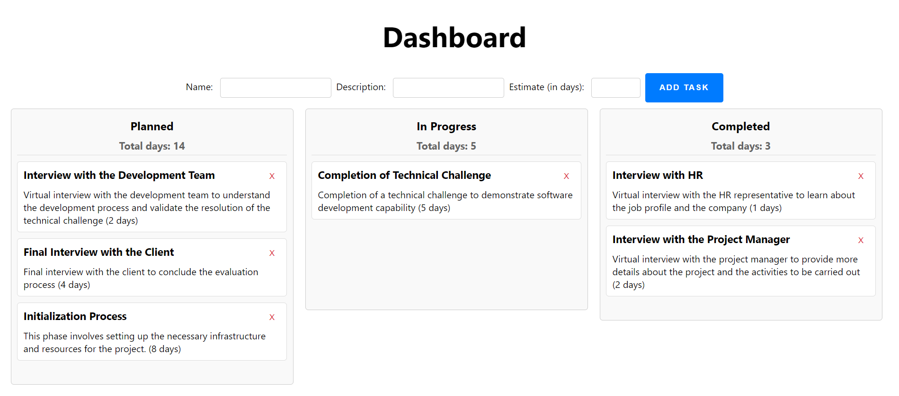

# Task Tracker SPA

## Description
Task Tracker is a Single Page Application (SPA) that allows users to manage tasks categorized into three distinct states: Planned, In Progress, and Completed. The app provides functionalities to add, remove, and change the state of tasks, as well as to display an updated status by summing all days for each state.



## Features
- Display tasks in three distinct states.
- Full CRUD capabilities for tasks via a REST API.
- Aggregation of estimated days by task state.

## Technologies Used
- Backend: Django Rest Framework
- Frontend: HTML, CSS, JavaScript
- Database: SQLite

## Installation

### Environment Setup
```bash
# Clone the repository
git clone https://github.com/fedenavos/task_tracker.git

# Navigate to the project directory
cd task_tracker

# Install dependencies
pip install -r requirements.txt
```

### Database Setup
```bash
# Create a new migration
python manage.py makemigrations

# Create a database
python manage.py migrate

# Create a superuser
python manage.py createsuperuser

# Add some tasks
python seed.py
```

## Usage
```bash
# Run the development server
python manage.py runserver
```

### Dashboard

The dashboard displays all tasks in the database. The user can drag and drop tasks to change their state and add new tasks.
You can find the dashboard at http://127.0.0.1:8000/dashboard.

### API Endpoints
- `GET /api/tasks/` - List all tasks
- `POST /api/tasks/` - Create a new task
- `PUT /api/tasks/<int:pk>/` - Update a task by ID
- `DELETE /api/tasks/<int:pk>/` - Delete a task by ID
- `PATCH /api/tasks/<int:pk>/` - Update a task by ID

Documentation for the API endpoints can be found in the swagger documentation (http://127.0.0.1:8000/swagger).

### Admin panel

The admin panel allows the user to add, remove, and change tasks. You can find the admin panel at http://127.0.0.0.1:8000/admin.

## License
[MIT](https://choosealicense.com/licenses/mit/)

## Contact
[Federico Navós](https://www.linkedin.com/in/federico-navos/)

## Acknowledgements
- [Django Rest Framework](https://www.django-rest-framework.org/)
- [Django](https://www.djangoproject.com/)
